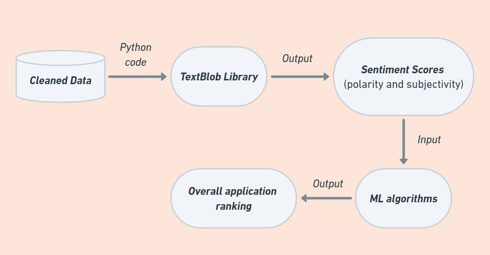
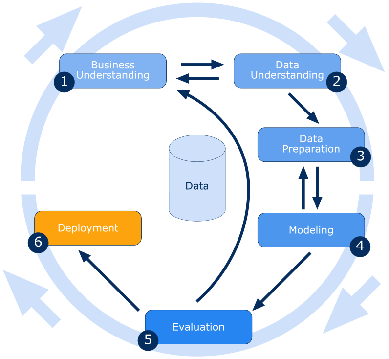
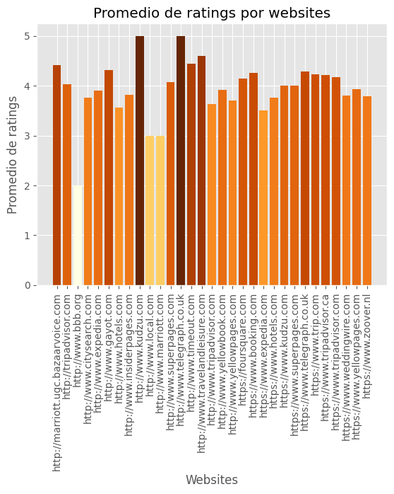

# Machine Learnig - Reviews Hostel


## _Análisis de Sentimiento y modelos de regresión_

Esta es una lista de 1,000 hoteles y sus reseñas proporcionada por la base de datos comercial de **Datafiniti**, descargada desde la web de 'data.world'. El conjunto de datos incluye la ubicación del hotel, el nombre, la valoración, los datos de los comentarios, el título, el nombre de usuario y más.

Con este trabajo, se pretende dar respuesta a un problema real de negocio.

- El Hotel quiere que analicemos el sentimiento de los `comentarios` que le van dejando sus clientes, para poder **predecir que valoración** (en `Nº de estrellas`) nos podrá poner en la web de TripAdvisor/hotels.com/booking.com, etc. Ya que en función a la nota media que tengamos, tendremos una mejor posicionamiento en el buscador y eso nos ayudará a tener mayor volumen de negocio. 


- Además, si podemos identificar patrones que nos pueda arrojar cierta información relevante, será útil para el departamento de marketing.

### **Síntesis del trabajo que se realizará:**

>Inicialmente se analizarán los datos y se tomará la decisión de enfocarlo como un problema de regresión lineal. Para poder predecir la variable target, se analizará el sentimiento de la varaible `reviews.text` y se usará ese dato como variable predictora para el modelo de regresión lineal. 

## Definiciones

Dentro del campo del Procesamiento de Lenguaje Natural (**NLP**) se ha generado un ecosistema de algoritmos que permiten el análisis y clasificación de datos a partir del aprendizaje automatizado. El presente trabajo se centra en el llamado **análisis de sentimiento**, mediante el cual, es posible la clasificación de textos en inglés según una `polaridad`, en nuestro caso _positiva o negativa_. Como caso de uso concreto se analizarán las reviews de las diferentes plataformas de valoración de hoteles.



Dentro del análisis inicial y después de ver las diferentes técnicas y algoritmos dedicados al NLP se han implementado y probado cuatro algoritmos diferentes: por un lado, los algoritmos más clásicos, Linear Regression y Polynomical Features, y por otro lado algunos un poco más robustos como Decission Tree Regressor y Random Forest Regressor. 

## Enfoque y método seguido

- Búsqueda de un dataset que nos ayude en la construcción del modelo.
- Análisis EDA que ayude a comprender bien la realidad del caso.
- Preparación de los datos del dataset.
- Entrenamiento de los modelos de predicción.
- Evaluación de los modelos seleccionados.
- Obtención los resultados y conclusión sobre los mismos.


## Estructura del proyecto

Cabe destacar que la estructura puede verse afectada dado que he tenido que adaptar los archivos para que pudieran subir al repositorio, por problemas de espacio. Simplemente tiene que descomprimir los archivos `.zip` que aparecen en la carpeta raiz.

```
├── SRC/                                                   
├── Data/                                                  
│   ├── datafiniti-hotel-reviews/                          
│   │     ├── 7282_1-csv                                   
│   │     ├── Datafiniti_Hotel_Reviews_Jun19.csv           
│   │     └── Datafiniti_Hotel_Reviews.csv                 
│   ├── primera_entrega/                                   
│   │     ├── X_test.csv                                   
│   │     └── y_test.csv                                   
│   ├── center_province.csv                                
│   ├── Crime_Data_from_2020_to_Present.csv                                              
│   ├── state_crime.csv                                    
│   ├── test.csv                                           
│   └── train.csv                                          
├── Export_models/                                         
│         └── primer_modelo.zip                            
├── model/                                                 
│    ├─── Primera entrega/                                  
│    │      ├── dtr_model.pkl                               
│    │      └── knn_model.pkl                               
│    ├── dtr_230214.pkl                              
│    ├── lin_reg_230214.pkl                          
│    ├── poly_reg_230214.pkl                         
│    └── rfr_230214.pkl                              
├── notebooks/                                             
│           └── primera_entrega.ipynb                      
├── production/ 
│           └── best_model.pkl                                           
├── utils                                                  
│   │                                                      
│   └── functions.py                           		   
│       				                   
├── memoria-ipynb                                          
├── predict.py                                             
└── train.py 
```
.

## Datos interesantes sobre la investigación

dejaremos algunas pinceladas de las cosas que se han ido descubriendo a medida que avanzaba el análisis.

**Vemos algo curioso aqui:**

- Vemos que frente a `8068 reviews positivas`, solo disponemos de `6120 títulos positivos`. *Hay más personas que inicialmente colocan un título para su review de manera neutral o negativa, y que acaban poniendo un comentario positivo.*
- Frente a `1406 reviews neutrales`, tenemos `3173 títulos neutrales`. *Las personas tienden a neutralizar sus sentimientos, a la hora sintetizar su experiencia.* 
- Frente a `526 reviews negativos`, tenemos `707 títulos negativos`. *Parece ser que es más fácil expresar sentimientos negativos si no se debe profundizar sobre ello, pero a la hora explayarse en descripciones o explicaciones, las personas tienden a relativizar y transforman su experiencia en neutral o positiva.*
- 




- Según la gráfica, vemos que los que mejores valoraciones han dado son desde la web de `kudzu` y `telegraph`, sin embargo, ambas suponen un `0.2%` y `0.9%` respectivamente de todas las reviews.
- `bbb.org`, por su parte, solo aporta una valoración negativa, es decir, supone un 0,0001% del total. 
- Sin embargo, en webs como `foursquare` o `yellowpages`, que rondan entre ambas el 36% del total de las valoraciones, supera las 4 estrellas de media.

Con esto sacamos en claro que los `outliers` (que pueden rondar el 1%) no son muchos, pero se tendrá en cuenta para no desvirturar el modelo de predicción.

## Principales Librerías necesarias para el proyecto

```
import numpy as np
import pandas as pd
import statsmodels.api as sm
import missingno as mss
import re
---------------
import matplotlib.pyplot as plt
from matplotlib import style
import seaborn as sns
---------------
from textblob import TextBlob
---------------
from collections import Counter
from sklearn.preprocessing import StandardScaler, MinMaxScaler, PolynomialFeatures
from sklearn.model_selection import train_test_split
from sklearn.neighbors import KNeighborsClassifier
from sklearn.metrics import classification_report
from sklearn.metrics import confusion_matrix
from sklearn.tree import DecisionTreeRegressor, DecisionTreeClassifier
from sklearn.metrics import mean_absolute_error, mean_absolute_percentage_error, mean_squared_error, r2_score
from sklearn.model_selection import GridSearchCV
from sklearn.metrics import accuracy_score, confusion_matrix, roc_auc_score
from sklearn.linear_model import LogisticRegression
from sklearn.model_selection import cross_val_score
from sklearn.metrics import roc_curve
from sklearn.ensemble import RandomForestClassifier
from sklearn.decomposition import PCA
from sklearn.feature_selection import SelectKBest, f_regression
from scipy.stats.stats import pearsonr, skew
from scipy.stats import shapiro
from imblearn.over_sampling import RandomOverSampler
from imblearn.over_sampling import SMOTE
from imblearn.under_sampling import RandomUnderSampler
from imblearn.pipeline import Pipeline
from sklearn.impute import SimpleImputer
from sklearn.tree import DecisionTreeRegressor
from sklearn.linear_model import LinearRegression, Ridge, Lasso, ElasticNet
from sklearn.ensemble import RandomForestRegressor
from sklearn.model_selection import cross_val_score
```
